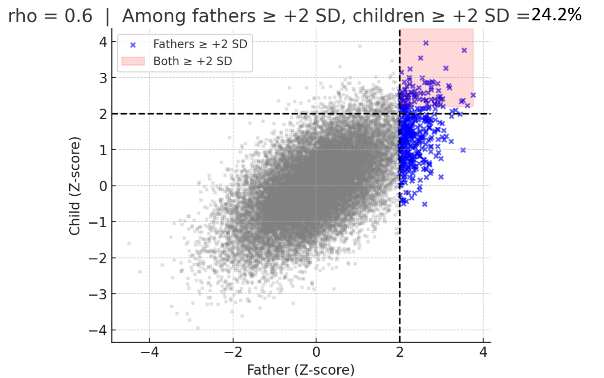
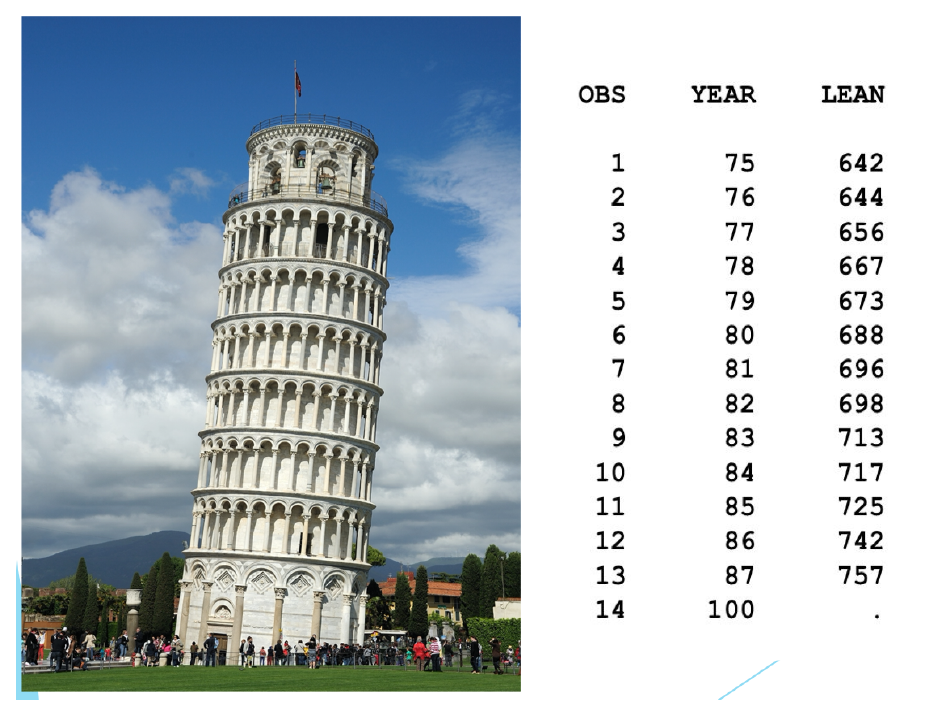
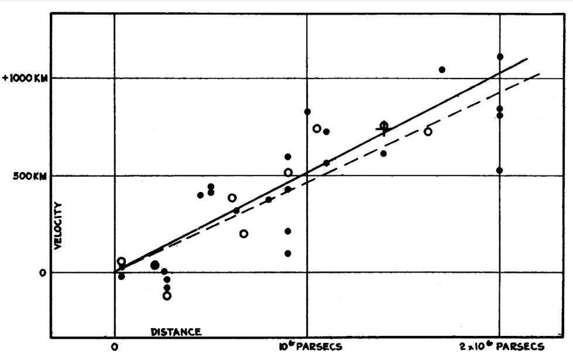
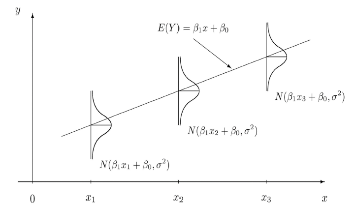
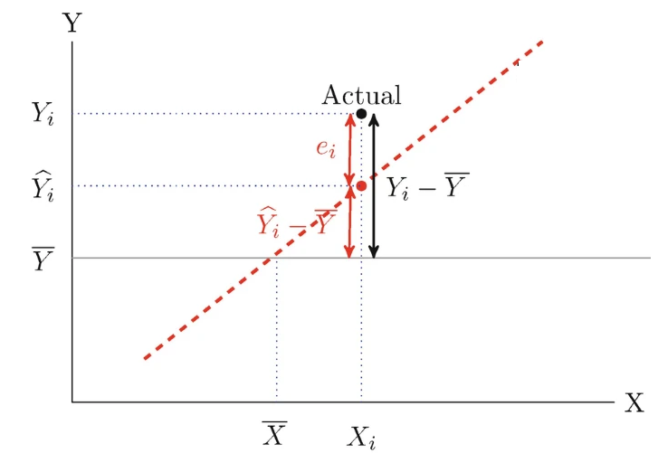
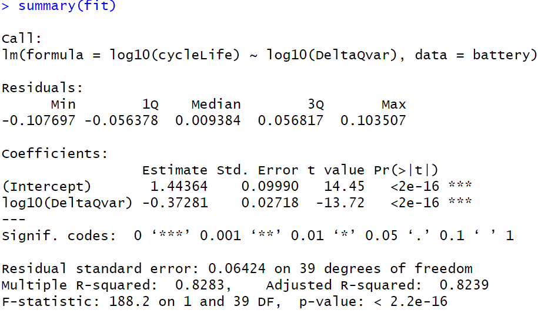

```{r}
#| include: false
knitr::opts_chunk$set(echo = FALSE, message = FALSE, warning = FALSE)
knitr::opts_chunk$set(echo = TRUE)
library(tidyr) #the pipe (%>%) tool is extremely useful
library(MASS)
```


# Introduction

## History of regression

-   1700: Newton wrote normal equations for least squares, several other
    researchers did similar calculations
-   1805: Legendre published method of least squares
-   1809: Gauss claimed to have used least squares since 1795
-   1821: Gauss published his method of least squares, introduced
    maximum likelihood and normal distribution, discussed optimality
-   1886: Galton published "Regression towards mediocrity in hereditary
    stature"

## Regression towards mediocrity

-   Galton, F., 1886. Regression towards mediocrity in hereditary
    stature. The Journal of the Anthropological Institute of Great
    Britain and Ireland, 15, pp.246-263.
-   Provided one of the earliest scatterplots with a fitted line.

::: {style="text-align: center;"}
{fig-align="center" width=70%}
:::

## Regression to the mean

-   Galton observed that extreme values on one measurement tend to be
    associated with less extreme values on another measurement.
-   This phenomenon is now known as "regression to the mean".
    <!-- calculations related to these probabilities can be done by cdf of mvn -->

{fig-align="center" width=70%}

## After Galton

-   1896: Pearson (Galton's student) developed correlation coefficient
-   1901: Yule (Pearson's student) developed multiple regression
-   1920s: Fisher (Pearson's student) developed analysis of variance
    (ANOVA), F-tests

## Why Do We Still Need to Learn Linear Regression?

-   **Foundation of statistical modeling**
    -   Still widely used today\
    -   Basis for many modern methods (GLM, mixed models, ridge, Lasso,
        deep learning layers, ...)
-   **Interpretability**
    -   Coefficients have clear meaning: expected change in outcome per
        unit increase in predictor\
    -   Provides intuition about relationships between variables
-   **Practical importance**
    -   Still used daily in almost all areas: medicine, economics,
        engineering, and social sciences

## Example: Leaning tower of Pisa

-   Response variable: Lean of the tower (in mm)
-   Predictor variable: Year (19xx)


{fig-align="center" width=70%}


## Example: Leaning tower of Pisa

```{r, message=FALSE, warning=FALSE}
# Pisa tower data
pisa <- data.frame(
  obs  = 1:13,
  year = 75:87,
  lean = c(642, 644, 656, 667, 673, 688, 
           696, 698, 713, 717, 725, 742, 757)
)

# Scatter plot with regression line
plot(pisa$year, pisa$lean,
     pch = 19, col = "blue",
     xlab = "Year (19xx)",
     ylab = "Lean (mm)",
     main = "Leaning of the Pisa Tower Over Time")

# Add regression line
fit <- lm(lean ~ year, data = pisa)
abline(fit, col = "red", lwd = 2)
```

## Example: Hubble's law (1929)

-   Galaxies are moving away from us
-   the farther away a galaxy is, the faster it is moving away


{fig-align="center" width=70%}


# SLR

## Simple Linear Regression

-   In a Simple Linear Regression Model, a single predictor
    (independent/explanatory variable) is used to predict a
    response/dependent variable

## Simple Linear Regression

-   A simple linear regression line describes a linear relationship
    between \_\_ and \_\_: $$E(y|x) = \beta_0 + \beta_1 x$$

-   The simple linear regression model
    $$y=\beta_0 + \beta_1 x + \epsilon$$ where $\epsilon$ is random
    error.

## Notation

-   For the individual $i$:
    $$y_i = \beta_0 + \beta_1 x_i + \epsilon_i, \quad i=1, \cdots, n$$

-   $\beta_0, \beta_1$: regression coefficients (uknown parameters)

    -   $\beta_0$: intercept
    -   $\beta_1$: slop

-   $y_i$: observed response value of individual $i$

-   $x_i$: observed predictor value of individual $i$

-   $\epsilon_i$: random error of individual $i$

## Assumptions: Basic (a)

-   Basic assumptions
    1.  Linearity: The relationship between the predictor and the mean
        of the response is linear. $$E(y_i|x) = \beta_0 + \beta_1 x_i$$
        Equivalently,, $$E(\epsilon)=0$$

    2.  Uncorrelated errors: The errors are uncorrelated.
        $$Cov(\epsilon_i, \epsilon_j)=0, \quad i\neq j$$

    3.  Homoscedasticity: The errors have constant variance at all
        levels of the predictor.
        $$Var(\epsilon_i)=\sigma^2, i=1, \cdots, n$$

## Assumptions: Stronger (b)

-   Stronger assumptions
    1.  Linearity
    2.  Independence: The errors are independent.
    3.  Normality: The errors are normally distributed.
-   The above assumptions are equivalent to
    $$\epsilon_1, \cdots, \epsilon_n \overset{iid} \sim N(0, \sigma^2)$$

## Implications of Assumptions (a)

Regression Model:
$y_i = \beta_0 + \beta_1 x_i + \epsilon_i, \quad i=1, \cdots, n$

-   For a given $x_i$, under the basic assumptions (a) or (b), we have
    -   $y_i$ is a random variable
    -   $E(y_i|x_i) = \beta_0 + \beta_1 x_i$
    -   $Var(y_i|x_i) = \sigma^2$
    -   $Cov(y_i, y_j|x_i, x_j)=0, i\neq j$,
        \textcolor{red}{uncorrelated, but not necessarily independent}

## Implications of Assumptions (b)

Regression Model:
$y_i = \beta_0 + \beta_1 x_i + \epsilon_i, \quad i=1, \cdots, n$

-   For a given $x_i$, under the  assumptions (b), we have
    -   $y_i \sim N(\beta_0 + \beta_1 x_i, \sigma^2)$
    -   $y_1, \cdots, y_n$ are independent
    
{fig-align="center" width=80%}


# Estimate $\beta_0, \beta_1$

## Estimate coefficients

-   Predicted / Fitted values
    $\hat{y}_i = \hat{\beta}_0 + \hat{\beta}_1 x_i$.

-   Observed errors (residuals)
    $e_i = y_i - \hat{y}_i = y_i - \hat{\beta}_0 - \hat{\beta}_1 x_i$.

-   Sum of Squared Errors (SSE), also known as Residual Sum of Squares
    (RSS):
    $$RSS = SSE= \sum_{i=1}^n e_i^2 = \sum_{i=1}^n (y_i - \hat{y}_i)^2=\sum_{i=1}^n (y_i - \hat\beta_0 - \hat\beta_1 x_i)^2$$

-   The Least Squares Estimation (LSE) criterion chooses
    $\hat{\beta}_0, \hat{\beta}_1$ that minimizes RSS (SSE).

## Normal Equations

-   The normal equations are obtained by setting the partial derivatives
    of RSS with respect to $\hat{\beta}_0$ and $\hat{\beta}_1$ to zero:
    $$\frac{\partial RSS}{\partial \hat{\beta}_0} = -2 \sum_{i=1}^n (y_i - \hat{\beta}_0 - \hat{\beta}_1 x_i) = 0$$
    $$\frac{\partial RSS}{\partial \hat{\beta}_1} = -2 \sum_{i=1}^n x_i (y_i - \hat{\beta}_0 - \hat{\beta}_1 x_i) = 0$$
-   Solving these equations gives the least squares estimates.

## Least Squares Estimates

-   The least squares estimates for the coefficients are:
    $$\hat{\beta}_1 = \frac{\sum_{i=1}^n (x_i - \bar{x})(y_i - \bar{y})}{\sum_{i=1}^n (x_i - \bar{x})^2}$$
    $$\hat{\beta}_0 = \bar{y} - \hat{\beta}_1 \bar{x}$$ where
    $\bar{x} = \frac{1}{n} \sum_{i=1}^n x_i$ and
    $\bar{y} = \frac{1}{n} \sum_{i=1}^n y_i$ are the sample means of $x$
    and $y$, respectively.

$\hat\beta_0, \hat\beta_1$ are called least squares estimators.

## Sum of Squares in Simple Linear Regression

-   $S_{yy}=\sum_{i=1}^n (y_i - \bar{y})^2$, total sum of Squares of $y$
-   $S_{xx}=\sum_{i=1}^n (x_i - \bar{x})^2$, total sum of Squares of $x$
-   $S_{xy}=\sum_{i=1}^n (x_i - \bar{x})(y_i - \bar{y})$, covariance sum
    of Squares.

The least squares estimates can be expressed as:
$$\hat{\beta}_1 = \frac{S_{xy}}{S_{xx}}, \quad \hat{\beta}_0 = \bar{y} - \hat{\beta}_1 \bar{x}$$
It can be shown that
$SSE=S_{yy} - \hat\beta_1 S_{xy} = S_{yy} - \frac{S_{xy}^2}{S_{xx}}$.

## Properties of Fitted Values and Residuals

-   The sum of the residuals is zero: $\sum_{i=1}^n e_i = 0$.
-   The least squares regression line passes through the point
    $(\bar{x}, \bar{y})$ because
    $\hat\beta_0 + \hat\beta_1 \bar x = \bar y$ (by the normal
    equation).
-   The sum of the observed values = the sum of the fitted values:
    $$\sum_{i=1}^n y_i = \sum_{i=1}^n \hat{y}_i$$
-   The sum of the residuals weighted by the predictor values or
    predicted values is zero:
    $$\sum_{i=1}^n x_i e_i = 0, \sum_{i=1}^n \hat{y}_i e_i  = 0$$

# Estimate Variance

## Estimate $\sigma^2$

-   An intuitive estimate of $\sigma^2$ might be:
    $$s^2 = \frac{1}{n} \sum_{i=1}^n e_i^2 = \frac{SSE}{n}$$
-   However, this estimate is biased because the residuals $e_i$ are not
    independent and have less variability than the true errors
    $\epsilon_i$.
-   An unbiased estimate of $\sigma^2$ is:
    $$s^2 = \frac{1}{n-2} \sum_{i=1}^n e_i^2 = \frac{SSE}{n-2}=MSE$$

# Coefficient of Determination

## Sum of Squares Decomposition

-   Total Sum of Squares (SST): $$SST = \sum_{i=1}^n (y_i - \bar{y})^2$$

-   Regression Sum of Squares (SSR):
    $$SSR = \sum_{i=1}^n (\hat{y}_i - \bar{y})^2$$ The variation
    explained by the predictor (regression model).

-   Error Sum of Squares (SSE):
    $$SSE = \sum_{i=1}^n (y_i - \hat{y}_i)^2$$

## Sums of Squares


{width=70%}

It can be shown that: $$SST = SSR + SSE$$

## Coefficient of Determination $R^2$

-   The coefficient of determination $R^2$ is defined as:
    $$R^2 = \frac{SSR}{SST} = 1 - \frac{SSE}{SST}$$
-   $R^2$ represents the proportion of variance in the response variable
    that is explained by the predictor variable.

## Correlation

-   The correlation coefficient, $\rho$, provides a measure of the
    strength and direction of a linear relationship between two
    variables, $x$ and $y$.

-   The sample correlation coefficient $r$ between $x$ and $y$ is given
    by:
    $$r = \frac{\sum_{i=1}^n (x_i - \bar x)(y_i -\bar y)}{\sqrt{\sum_{i=1}^n (x_i-\bar x)^2 \sum_{i=1}^n (y_i - \bar y)^2}} =\frac{S_{xy}}{\sqrt{S_{xx} S_{yy}}}$$

-   It can be shown that in simple linear regression, the coefficient of
    determination $R^2$ is equal to the square of the sample correlation
    coefficient $r$:

## Summary

-   LSE of $\beta_0, \beta_1$:
    $$\hat{\beta}_1 = \frac{S_{xy}}{S_{xx}}, \quad \hat{\beta}_0 = \bar{y} - \hat{\beta}_1 \bar{x}$$

-   Variance estimate:
    $$s^2 = \frac{SSE}{n-2}= \frac{1}{n-2} (S_{yy}- \frac{S_{xy}^2}{S_{xx}})$$

-   Coefficient of determination:
    $$R^2 = \frac{SSR}{SST} = \frac{SST-SSE}{SST} = \frac{S_{xy}^2}{S_{xx} S_{yy}} = r^2$$

## Useful Formulas

-   Useful formulas for calculating $S_{XX}, S_{YY}, S_{XY}$:
    $$\sum_{i=1}^n (x_i - \bar x)^2 = \sum_{i=1}^n x_i^2 - n \bar x^2$$
    $$\sum_{i=1}^n (y_i - \bar y)^2 = \sum_{i=1}^n y_i^2 - n \bar y^2$$
    $$\sum_{i=1}^n (x_i - \bar x)(y_i - \bar y) = \sum_{i=1}^n x_i y_i - n \bar x \bar y$$
-   Sufficient statistics for conducting regression analysis :
    $n, \sum x_i, \sum y_i, \sum x_i^2, \sum y_i^2, \sum x_i y_i$

# Example

## Example: Battery data

Background: Predicting cycle life of lithium-ion batteries from initial
cycles\
Source: [MathWorks Predictive Maintenance
Toolbox](https://www.mathworks.com/help/predmaint/ug/predict-remaining-cycle-life-of-batteries-from-initial-operation-data.html)

-   $x$: difference in discharge capacity as a function of voltage
    between 100th and 10th cycle
-   $y$: cycle life (number of cycles until the battery capacity falls
    below 80% of its initial capacity)
-   log10 both variables to get a linear relationship

## Example: Battery data

Scatter plot:

```{r, message=FALSE, warning=FALSE, fig.align='center', out.width='0.8\\linewidth'}
battery=read.csv("../data/battery.csv")
#names(battery)
#draw scatter plot x=DeltaQvar, y=cycleLife with log10 scale
plot(log10(battery$DeltaQvar), log10(battery$cycleLife),
     pch=19, col="blue",
     xlab="log10(DeltaQvar)",
     ylab="log10(cycleLife)",
     main="Battery Data")
```

## Example: Battery data

-   Fit a linear regression

```{r, message=FALSE, warning=FALSE, fig.align='center', out.width='0.8\\linewidth'}
fit <- lm(log10(cycleLife) ~ log10(DeltaQvar), data = battery)
plot(log10(battery$DeltaQvar), log10(battery$cycleLife),
     pch=19, col="blue",
     xlab="log10(DeltaQvar)",
     ylab="log10(cycleLife)",
     main="Battery Data")
abline(fit, col="red", lwd=2)
```

## Example: Battery data

-   Summary of the fitted model 

<!--
    ```{r, size="tiny"}
    summary(fit)
    ```
-->

{width=70%}


## Example: Battery data

Do the calculations ``manually'':

-   sufficient statistics:

```{r}
n = nrow(battery)
sum_x = sum(log10(battery$DeltaQvar))
sum_y = sum(log10(battery$cycleLife))
sum_x2 = sum(log10(battery$DeltaQvar)^2)
sum_y2 = sum(log10(battery$cycleLife)^2)
sum_xy = sum(log10(battery$DeltaQvar)*log10(battery$cycleLife))
n; sum_x; sum_y; sum_x2; sum_y2; sum_xy
mean_x = sum_x/n
mean_y = sum_y/n
mean_x; mean_y
S_xx = sum_x2 - n*mean_x^2
S_yy = sum_y2 - n*mean_y^2
S_xy = sum_xy - n*mean_x*mean_y
S_xx; S_yy; S_xy
b1_hat = S_xy/S_xx
b0_hat = mean_y - b1_hat*mean_x
b1_hat; b0_hat
SSE = S_yy - b1_hat*S_xy
sigma2_hat = SSE/(n-2)
sigma2_hat
```


## How to Calculate Simple Linear Regression Estimates

**Given summary statistics**\
- $n = 41$\
- $\sum x_i = -149.953,\; \sum y_i = 115.0934$\
- $\sum x_i^2 = 554.024,\; \sum y_i^2 = 324.0225$\
- $\sum x_i y_i = -423.0244$

------------------------------------------------------------------------

**Step 1. Compute sufficient statistics**

$$
\bar{x} = \tfrac{-149.953}{41} \approx -3.66, 
\quad 
\bar{y} = \tfrac{115.0934}{41} \approx 2.81
$$

$$
S_{xx} = 554.024 - \tfrac{(-149.953)^2}{41} \approx 5.59
$$

$$
S_{yy} = 324.0225 - \tfrac{(115.0934)^2}{41} \approx 0.94
$$

$$
S_{xy} = -423.0244 - \tfrac{(-149.953)(115.0934)}{41} \approx -2.08
$$

------------------------------------------------------------------------

**Step 2. Regression coefficients**

$$
\hat\beta_1 = \tfrac{S_{xy}}{S_{xx}} \approx \tfrac{-2.08}{5.59} \approx -0.37
$$

$$
\hat\beta_0 = \bar{y} - \hat\beta_1 \bar{x} 
   \approx 2.81 - (-0.37)(-3.66) 
   \approx 1.46
$$

------------------------------------------------------------------------

**Step 3. Error variance**

$$
\hat\sigma^2 = \tfrac{1}{n-2}\left(S_{yy} - \hat\beta_1 S_{xy}\right)
= \tfrac{1}{39}(0.94 - (-0.37)(-2.08)) 
\approx \tfrac{0.17}{39}
$$

$$
\hat\sigma \approx  \sqrt{\ 0.0044} \approx 0.066; 
$$

## Interpretation of coefficients

-   $\hat\beta_1 \approx -0.37$: For a one unit increase in
    log10(DeltaQvar), the expected change in log10(cycleLife) is a
    decrease of approximately 0.37 units.<!--, holding all else constant.-->

-   $\hat\beta_0 \approx 1.46$:
    \textcolor{white}{When log10(DeltaQvar) is zero, the expected value of log10(cycleLife) is approximately 1.46. }

## Coefficient of Determination

-   $R^2 = \frac{S_{xy}^2}{S_{xx} S_{yy}} \approx \frac{(-2.08)^2}{5.59 \times 0.94} \approx 0.82$

-   About 82% of the variability in log10(cycleLife) can be explained by
    the linear relationship with log10(DeltaQvar).

-   $r = \frac{S_{xy}}{\sqrt{S_{xx} S_{yy}}} \approx \frac{-2.08}{\sqrt{5.59 \times 0.94}} \approx -0.91$.

-   The strong negative correlation (-0.91) indicates a strong inverse
    linear relationship between log10(DeltaQvar) and log10(cycleLife).

- We will learn more about how to interpret the coefficients when transformation is used in later lectures.