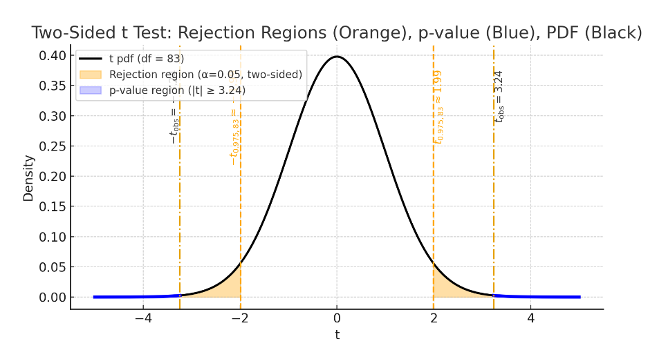
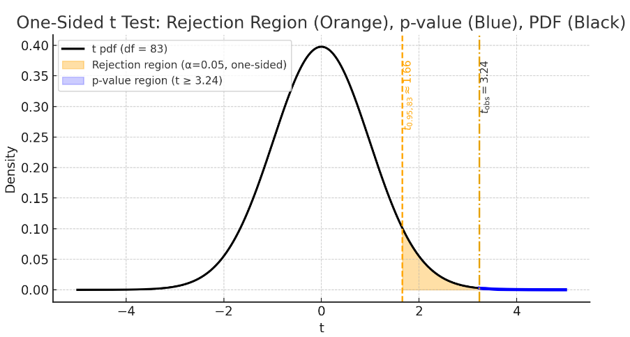

```{r}
#| include: false
knitr::opts_chunk$set(echo = FALSE, message = FALSE, warning = FALSE)
knitr::opts_chunk$set(echo = TRUE)
library(tidyr) #the pipe (%>%) tool is extremely useful
library(MASS)
```


# Overview

## Review

-   History of regression
-   Simple linear regression model
-   Least squares estimate
-   Estimate coefficients and variance
-   Coefficient of determination
-   Interpretation of coefficients

## Outline

-   Introduction to Inference in SLR
-   Hypothesis testing for regression coefficients
-   Confidence intervals for regression coefficients
-   Estimation and confidence intervals
    for mean response
-   Prediction and Prediction intervals for new observations
-   ANOVA for SLR

# Intro

## What is Statistical Inference

-   Broadly speaking, statistical inference is the process of drawing
    conclusions about a population based on a sample of data from that
    population.
-   There are different types of statistical inference, including:
    -   ***Estimation***: Estimating population parameters (e.g., mean,
        variance) based on sample statistics.
    -   ***Hypothesis Testing***: Testing assumptions or claims about
        population parameters using sample data.
    -   ***Prediction***: Making predictions about future observations
        based on a fitted model.
-   So far, we have learned how to estimate $\beta_0, \beta_1$ and
    $\sigma^2$ in SLR. Next, we will learn how to do inference in SLR.

## Inference Problems in SLR

-   Hypothesis testing for regression coefficients. Example,
    $H_0: \beta_1=0$ vs $H_a: \beta_1\neq 0$.

-   Confidence intervals for regression coefficients. Example, a 95% CI
    for $\beta_1$.

-   Prediction (\textcolor{red}{Estimation}) and confidence intervals
    for mean response. Example, estimation and a 95% CI for
    $E(y|x=x^*)$.

-   Prediction intervals for new observations. Example, a 95% PI for a
    new observation $y_{new}$ at $x=x^*$.

-   ANOVA for SLR. Example, test if the regression model is useful.

## How did we do inference for one-sample problems?

-   To understand inference in SLR, let's first review how we did
    inference for one-sample problems.

-   A random sample
    $y_1, y_2, \cdots, y_n \overset{iid}\sim N(\mu, \sigma^2)$.

-   The parameter of interest: $\mu$ (unknown).

-   Point estimate of $\mu$. $\bar{y}=\frac{1}{n}\sum_{i=1}^n y_i$ to
    estimate the population mean $\mu$.

-   Sampling distribution of $\bar{y}$:
    $\bar{y} \sim N(\mu, \frac{\sigma^2}{n})$.

-   But $\sigma^2$ is unknown. We estimate it by
    $s^2=\frac{1}{n-1}\sum_{i=1}^n (y_i-\bar{y})^2$.

-   Standard error (SE) of $\bar{y}$:
    $SE(\bar{y}) = \frac{s}{\sqrt{n}}$.

## Inference: hypothesis testing

-   Hypothesis test: $H_0: \mu=\mu_0$ vs $H_a: \mu\neq \mu_0$.

-   Test statistic:
    $$t=\frac{\bar{y}-\mu_0}{SE(\bar{y})}=\frac{\bar{y}-\mu_0}{s/\sqrt{n}} \overset{H_0}\sim t_{n-1}$$

-   Not normal?
    $y_1, y_2, \cdots, y_n \overset{iid}\sim (\mu, \sigma^2)$. The
    results can still be used when $n$ is large enough. Why?

## Inference Confidence Interval

-   A 100(1-$\alpha$)% confidence interval for $\mu$ is given by:
    $$\bar{y} \pm t_{\alpha/2, n-1} \times SE(\bar{y}) = \bar{y} \pm t_{\alpha/2, n-1} \frac{s}{\sqrt{n}}$$

-   The standard error (SE) quantifies the precision of the estimate.
    The smaller the SE, the more precise the estimate.

-   The critical value $t_{\alpha/2, n-1}$ determines the width of the
    confidence interval. A larger critical value (smaller $\alpha$)
    results in a wider interval.

# Inference in SLR

## Outline

***Model***:
$y_i = \beta_0 + \beta_1 x_i + \epsilon_i, \quad i=1, \cdots, n$ where
$\epsilon_i \overset{iid}\sim N(0, \sigma^2)$.

We will derive the following results

1.  $E[\hat\beta_0]= \beta_0$, $E[\hat\beta_1]=\beta_1$. The LSE is
    ***unbiased***.

2.  $Var(\hat\beta_0)=\sigma^2[\frac{1}{n} + \frac{\bar{x}^2}{S_{xx}}]$,
    $Var(\hat\beta_1)=\frac{\sigma^2}{S_{xx}}$.
    <!--3.  $Cov(\hat\beta_0, \hat\beta_1)=-\frac{\sigma^2 \bar{x}}{S_{xx}}$. -->

3.  Sampling distributions of $\hat\beta_0, \hat\beta_1$.

## Review: Properties of Expectation and Variance

A random variable $X\sim (\mu, \sigma^2)$, i.e.,
$E(X)=\mu, Var(X)=E[(X-\mu)^2]=\sigma^2$

-   $E(aX+b)=aE(X)+b=a\mu+b$
-   $Var(aX+b)=a^2 Var(X)=a^2 \sigma^2$

For random variables $X_1, X_2$,

-   $E(X_1+X_2)=E(X_1)+E(X_2)$
-   If $X_1, X_2$ are independent, then
    $Var(X_1+X_2)=Var(X_1)+Var(X_2)$.

## Expectation of $\hat\beta_1$

-   Recall that \begin{eqnarray*}
    \hat{\beta_1} &=& \frac{S_{xy}}{S_{xx}} = \frac{\sum_{i=1}^n (x_i - \bar{x})(y_i - \bar{y})}{S_{xx}}\\
    &=&\frac{\sum_{i=1}^n (x_i - \bar{x})y_i}{S_{xx}} - \frac{\bar y \sum_{i=1}^n (x_i - \bar{x})}{S_{xx}}
    \end{eqnarray*}

-   Since $\sum_{i=1}^n (x_i - \bar{x})=0$, we have
    $$\hat\beta_1 =\frac{\sum_{i=1}^n (x_i - \bar{x})y_i}{\sum_{i=1}^n (x_i - \bar{x})^2}$$

## Expectation of $\hat\beta_1$

-   Since $y_i = \beta_0 + \beta_1 x_i + \epsilon_i$ and
    $E[\epsilon_i]=0$, we have 
    
$$
\begin{aligned}
E(\hat{\beta}_1)
&= E\!\left[
\frac{\sum_{i=1}^n (x_i-\bar{x})y_i}{S_{xx}}
\right] \\[6pt]
&= \frac{1}{S_{xx}}
   \sum_{i=1}^n (x_i-\bar{x})E(y_i) \\[6pt]
&= \frac{1}{S_{xx}}
   \sum_{i=1}^n (x_i-\bar{x})(\beta_0+\beta_1x_i) \\[6pt]
&= \frac{\beta_1}{S_{xx}}
   \sum_{i=1}^n (x_i-\bar{x})x_i \\[6pt]
&= \beta_1.
\end{aligned}
$$


## Variance of $\hat\beta_1$

-   Recall that $Var(y_i)=Var(\epsilon_i)=\sigma^2$ and $y_i's$ are
    uncorrelated (a stronger assumption is independence)

<!--::: {style="font-size: 60%;"}:::-->


$$
\begin{aligned}
\operatorname{Var}(\hat{\beta}_1)
&= \operatorname{Var}\!\left[
\frac{\sum_{i=1}^n (x_i-\bar{x})y_i}{S_{xx}}
\right] \\[6pt]
&= \frac{1}{S_{xx}^2}\,
   \operatorname{Var}\!\left[
   \sum_{i=1}^n (x_i-\bar{x})y_i
   \right] \\[6pt]
&= \frac{1}{S_{xx}^2}
   \sum_{i=1}^n (x_i-\bar{x})^2\,
   \operatorname{Var}(y_i) \\[6pt]
&= \frac{\sigma^2}{S_{xx}^2}
   \sum_{i=1}^n (x_i-\bar{x})^2 \\[6pt]
&= \frac{\sigma^2}{S_{xx}}.
\end{aligned}
$$

# Distribution

## Distribution of $\hat\beta_1$ when $\sigma^2$ is known

-   Since $\hat\beta_1$ is a linear combination of $y_i's$ and $y_i's$
    are normally distributed, $\hat\beta_1$ is also normally
    distributed.

-   Thus, when $\sigma^2$ is known, we have
    $$\hat\beta_1 \sim N(\beta_1, \frac{\sigma^2}{S_{xx}})$$

-   The standardized version:
    $$Z=\frac{\hat\beta_1 - \beta_1}{\sqrt{Var(\hat\beta_1)}} = \frac{\hat\beta_1 - \beta_1}{\sqrt{\sigma^2/S_{xx}}}=\frac{\hat\beta_1 - \beta_1}{\sigma/\sqrt{S_{xx}}} \sim N(0, 1)$$

## CI for $\beta_1$ when $\sigma^2$ is known

-   Because
    $\frac{\hat\beta_1 - \beta_1}{\sigma/\sqrt{S_{xx}}}  \sim N(0, 1)$,
    we have

$$P\left(-z_{1-\alpha/2} \leq \frac{\hat\beta_1 - \beta_1}{\sigma/\sqrt{S_{xx}}} \leq z_{1-\alpha/2}\right) = 1-\alpha$$
Therefore, a 100(1-$\alpha$)% confidence interval for $\beta_1$ is given
by:
$$(\hat\beta_1 - z_{1-\alpha/2} \frac{\sigma}{\sqrt{S_{xx}}}, \hat\beta_1 + z_{1-\alpha/2} \frac{\sigma}{\sqrt{S_{xx}}})$$
Note $-z_{1-\alpha/2} = z_{\alpha/2}$.

## Distribution of $\hat\beta_1$ when $\sigma^2$ is unknown

-   When $\sigma^2$ is unknown, we estimate it by $s^2=\frac{SSE}{n-2}$.

-   We define $\hat{Var}(\hat{\beta_1})=\frac{s^2}{S_{xx}}$ and the
    estimated standard error
    $SE(\hat\beta_1)=\sqrt{\hat{Var}(\hat{\beta_1})}=\frac{s}{\sqrt{S_{xx}}}$.

-   The standardized version:
    $$\frac{\hat\beta_1 - \beta_1}{SE(\hat\beta_1)} = \frac{\hat\beta_1 - \beta_1}{s/\sqrt{S_{xx}}} $$

## How to construct a t-distributed statistic?

-   Let $Z$ be a standard normal random variable
-   Let $U$ be a chi-square random variable with $v$ degrees of freedom
-   Suppose $Z$ and $U$ are independent
-   Then the random variable $$T=\frac{Z}{\sqrt{U/v}}$$ has a
    t-distribution with $v$ degrees of freedom, i.e., $T\sim t_v$.

## Details about the t-statistic in SLR

The assumptions of the SLR model: 1.
$y_i = \beta_0 + \beta_1 x_i + \epsilon_i, \quad \text{where } \epsilon_1, \cdots, \epsilon_n \overset{iid}\sim N(0, \sigma^2)$

Under the assumptions, we can show

-   $\hat\beta_1 \sim N(\beta_1, \frac{\sigma^2}{S_{xx}})$, which
    implies that
    $$Z=\frac{\hat\beta_1 - \beta_1}{\sigma/\sqrt{S_{xx}}} \sim N(0, 1)$$

-   $\hat\beta_1$ and $s^2$ are independent, which implies that $Z$ and
    $s^2$ are independent.

-   $\frac{(n-2)s^2}{\sigma^2}=\frac{SSE}{\sigma^2} \sim \chi^2_{n-2}$.

## Details about the t-statistic in SLR

-   By the way to construct a t-distributed statistic, we have
    $$T=\frac{Z}{\sqrt{U/(n-2)}}\sim t_{n-2}$$ where
    $Z=\frac{\hat\beta_1 - \beta_1}{\sigma/\sqrt{S_{xx}}}$ and
    $U=\frac{(n-2)s^2}{\sigma^2}$.

Thus, we have
$$T=\frac{\hat\beta_1 - \beta_1}{s/\sqrt{S_{xx}}} =\frac{\hat\beta_1 - \beta_1}{SE(\hat\beta_1)}  \sim t_{n-2}$$

-   Note that we have $n-2$ degrees of freedom because we estimated two
    parameters $\beta_0$ and $\beta_1$ in SLR.

# CI

## CI for $\beta_1$ when $\sigma^2$ is unknown

-   Because
    $\frac{\hat\beta_1 - \beta_1}{SE(\hat\beta_1)} \sim t_{n-2}$, we
    have

$$P\left(-t_{n-2, 1-\alpha/2} \leq \frac{\hat\beta_1 - \beta_1}{SE(\hat\beta_1)} \leq t_{n-2, 1-\alpha/2}\right) = 1-\alpha$$

-   Therefore, a 100(1-$\alpha$)% confidence interval for $\beta_1$ is
    given by:
    $$(\hat\beta_1 - t_{n-2, 1-\alpha/2} SE(\hat\beta_1), \hat\beta_1 + t_{n-2, 1-\alpha/2} SE(\hat\beta_1))$$
    where $SE(\hat\beta_1)=\frac{s}{\sqrt{S_{xx}}}$.

## Example: Mount Airy and Charleston

Summer temperature averages in Mount Airy, NC and Charleston, SC
(1937-2021)

```{r, echo=FALSE, fig.align='center', out.width='0.7\\linewidth'}

```

## Example: Mount Airy and Charleston

```{r, eval=FALSE, fig.align='center', out.width='0.7\\linewidth'}
mtair=read.csv("../data/mta1.csv", head=TRUE)
plot(mtair$MtAiry, mtair$Charl,
     xlab="MtAiry",
     ylab="Charl",
     main="Mount Airy and Charleston")
fit <- lm(Charl ~ MtAiry, data = mtair)
abline(fit, col="red", lwd=2)
```

## Example: Mount Airy and Charleston

```{r, echo=FALSE, fig.align='center', out.width='0.7\\linewidth'}
mtair=read.csv("../data/mta1.csv", head=TRUE)
plot(mtair$MtAiry, mtair$Charl,
     xlab="MtAiry",
     ylab="Charl",
     main="Mount Airy and Charleston")
fit <- lm(Charl ~ MtAiry, data = mtair)
abline(fit, col="red", lwd=2)
```

## Example: The fitting regression model

-   The fitted regression model is $$\hat{y} = 17.6 + 0.39 x.$$

-   Interpretation of coefficients:

    -   $\hat\beta_0 = 17.6$: When MtAiry is 0, the expected value of
        Charl is 17.6. Warning: this interpretation is not meaningful
        because MtAiry=0 is outside the range of the data.
    -   $\hat\beta_1 = 0.39$: For a one unit increase in MtAiry, the
        expected change in Charl is an increase of approximately 0.39
        units.

## Example: Mount Airy and Charleston


```{r}
summary(fit)
```


## Example: Mount Airy and Charleston

To obtain a 95% CI for $\beta_1$, we need the following values from the
R output

-   $\hat\beta_1 \approx 0.39$

-   $se(\hat\beta) \approx 0.1209$

-   $n-2=83$ (degrees of freedom) and $t_{83, 0.975} \approx 1.99$.

-   Therefore, a 95% CI for $\beta_1$ is given by:
    $$(0.39 - 1.99 \times 0.1209, 0.39 + 1.99 \times 0.1209) = (0.15, 0.63)$$
    \begingroup\tiny

```{r}
c(0.39 - qt(0.973, 83)* 0.1209, 0.39 + qt(0.973, 83)* 0.1209)
```

\endgroup

## Example: Mount Airy and Charleston

We can also use the R function `confint()` to obtain the confidence
intervals for regression coefficients.

\begingroup\tiny

```{r, echo=TRUE, size="tiny"}
confint(fit, level=0.95)
confint(fit, "MtAiry", level=0.95)
```

\endgroup

Therefore: $\hat\beta_1 \approx 0.39$ and a 95% CI for $\beta_1$ is
(0.15, 0.63).

***Interpretation*** of the 95% CI for $\beta_1$: With 95% confidence,
the estimated average summer temp in Charleston increases between 0.15
and 0.63 degrees Celsius per degree Celsius increment in average summer
temp in Mount Airy.

# Hypothesis Testing

## Hypothesis Testing in SLR

-   We will focus on hypothesis testing for $\beta_1$.

-   In SLR, we are often interested in testing whether there is a linear
    relationship between $x$ and $y$.

-   The ***null*** hypothesis is that there is no linear relationship,
    i.e., $\beta_1=0$.

-   The ***alternative*** hypothesis is that there is a linear
    relationship, i.e., $\beta_1 \neq 0$.

-   Thus, we want to test the following hypotheses:
    $$H_0: \beta_1=0 \quad \text{vs} \quad H_a: \beta_1 \neq 0$$

## Hypothesis testing in general: Five steps

-   Step 1: State the null and alternative hypotheses.
-   Step 2: Choose a significance level $\alpha$.
-   Step 3: Calculate a test statistic using the sample.
-   Step 4: Determine the rejection region or p-value.
-   Step 5: Make a decision and interpret the results.

## Test Statistic for $\beta_1$

-   The test statistic is given by:
    $$T=\frac{\hat\beta_1 - 0}{SE(\hat\beta_1)} = \frac{\hat\beta_1}{s/\sqrt{S_{xx}}}$$

-   When $H_0$ is true, i.e., $\beta_1=0$, $T \sim t_{n-2}$.

## Rejection/critical Region and p-value

-   Rejection region approach: Reject $H_0$ if
    $|T| > t_{n-2, 1-\alpha/2}$.

-   p-value approach: The p-value (two-sided) is given by
    $$p-value = 2P(T \geq |t_{obs}|)$$ where $t_{obs}$ is the observed
    value of the test statistic $T$. What is the distribution of $T$?

    -   If $p-value < \alpha$, we reject $H_0$.
    -   If $p-value \geq \alpha$, we fail to reject $H_0$. (there is not
        enough evidence to reject $H_0$).

## Rejection/critical Region and p-value

```{r, fig.align='center', out.width='0.9\\linewidth'}

```

## Example: Mount Airy and Charleston

-   Recall that $\hat\beta_1= 0.39$ and $SE(\hat\beta_1)=0.1209$.
-   The t-statistic is $T=\frac{0.3921-0}{0.1209} \approx 3.24$.
-   The degrees of freedom is $n-2=83$.
-   The critical value $t_{83, 0.975} \approx 1.99$. In R, use
    \`\`qt(0.975, 83)''. We reject the null hypothesis because
    $|3.24| > 1.99$.
-   The p-value is given by $2P(T \geq 3.24) \approx 0.0017$ (using R).
    We reject the null hypothesis because $0.0017 < 0.05$.
-   We conclude that there is a significant linear relationship between
    the average summer temperatures in Mount Airy and Charleston.


## Example: Mount Airy and Charleston

```{r}
summary(fit)
```


## One-sided tests: $H_1: \beta_1 > 0$

-   We can also perform one-sided tests. For example, to test
    $$H_0: \beta_1 \leq 0 \quad \text{vs} \quad H_a: \beta_1 > 0$$

    -   Rejection region approach: Reject $H_0$ if
        $T > t_{n-2, 1-\alpha}$.

    -   p-value approach: The p-value (right-sided) is given by
        $$p-value = P(T \geq t_{obs})$$ We reject $H_0$ if
        $p-value < \alpha$.

## One-sided tests: $H_1: \beta_1 > 0$

-   In some applications, we may be interested in testing one-sided
    alternatives. For example, we would like to know whether Mount Airy
    has a positive linear relationship with Charleston, i.e.,

    $$H_0: \beta_1 \geq 0 \quad \text{vs} \quad H_a: \beta_1 < 0$$

    -   Rejection region approach: Reject $H_0$ if
        $T < -t_{n-2, 1-\alpha}$.

    -   p-value approach: The p-value (left-sided) is given by
        $$p-value = P(T \leq t_{obs})$$

## Example: Mount Airy and Charleston

-   For the Mount Airy and Charleston example, we have $t_{obs} = 3.24$
    and $n-2=83$.
-   The critical value $t_{83, 0.95} \approx 1.66$. We reject the null
    hypothesis because $3.24 > 1.66$.
-   The p-value is given by $P(T \geq 3.24) \approx 0.00085$ (using R).
    We reject the null hypothesis because $0.00085 < 0.05$.

## Example: Mount Airy and Charleston

```{r, fig.align='center', out.width='0.9\\linewidth'}

```


```{r, echo=FALSE}
knitr::knit_exit()
```

```{r}
#| label: t-right-tail
#| echo: FALSE
#| message: FALSE
#| warning: FALSE
#| fig.width: 7
#| fig.height: 4.5

library(ggplot2)

df    <- 83
t_obs <- 3.24
t_crit <- qt(0.95, df)   # ≈ 1.66

# grid and pdf
x  <- seq(-5, 5, length.out = 2000)
pdf <- dt(x, df)
dat <- data.frame(x = x, y = pdf)

# areas to shade
rej <- subset(dat, x >= t_crit)
rej$region <- "Rejection region (α = 0.05, one-sided)"

pval <- subset(dat, x >= t_obs)
pval$region <- "p-value region (t ≥ 3.24)"

areas <- rbind(rej, pval)

# build plot
ggplot(dat, aes(x, y)) +
  geom_line(aes(color = "t pdf (df = 83)"), linewidth = 1.1, show.legend = TRUE) +
  geom_area(data = areas, aes(y = y, fill = region), alpha = 0.5, show.legend = TRUE) +
  geom_vline(xintercept = t_crit, linetype = "dashed", linewidth = 0.8) +
  geom_vline(xintercept = t_obs,  linetype = "dotdash", linewidth = 0.8) +
  annotate("text", x = t_crit, y = max(dat$y)*0.92,
           label = expression(t[0.95*","*83] %~% 1.66),
           angle = 90, vjust = 1.1, hjust = 1, size = 3.5) +
  annotate("text", x = t_obs, y = max(dat$y)*0.92,
           label = expression(t[obs] == 3.24),
           angle = 90, vjust = 1.1, hjust = 0, size = 3.5) +
  labs(
    title = "Right-Tailed t Test: Rejection Region and p-value",
    x = "t", y = "Density", color = NULL, fill = NULL
  ) +
  theme_minimal(base_size = 12) +
  theme(legend.position = "left")

```

